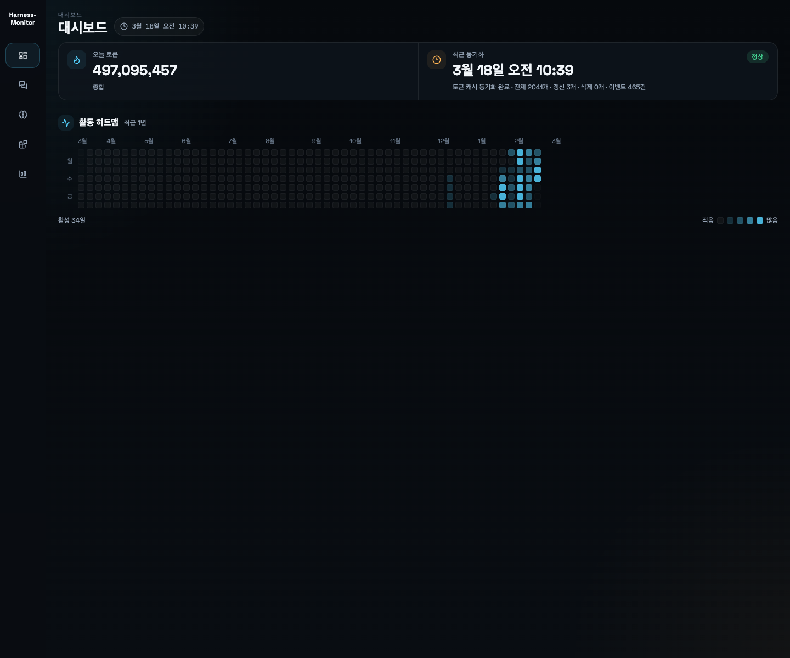

# Harness-Monitor

Harness-Monitor is a local monitoring UI for Codex CLI activity. It reads local Codex data and turns sessions, memory, integrations, and token usage into a single web dashboard.

The project currently runs on the `Codex` provider. The data layer is already split by provider so `Claude Code` can be added later without rewriting the whole app.

## Screenshots

### Dashboard



### Tokens


## What You Can See

### Dashboard

- Today token usage
- Latest sync time and collector status
- 1-year activity heatmap

### Sessions

- Project-based session list
- Search, sorting, and subagent filters
- Session timeline and event-level detail

### Memory

- Personal preference from `developer_instructions`
- Stage 1 memory extraction status
- Session memory list and raw memory

### Integrations

- MCP servers, skills, and hooks inventory
- Recent usage and detail views

### Tokens

- Daily total token chart for `7`, `30`, and `90` day ranges
- Model usage ratio donut chart
- Project token distribution bubble chart
- Project token navigation by `day`, `week`, and `month`
- Hourly token totals for the last 48 hours

## Data Sources

- The main data sources are `~/.codex` and `~/.agents`.
- Token analytics are built from `token_count` events in `~/.codex/sessions/**/*.jsonl`.
- The first sync backfills old rollout logs, then later syncs only re-read changed files.
- Project token usage is recovered from rollout `session_meta.cwd` and thread metadata.
- Model usage tracks the active model per turn and attributes `token_count` deltas to that model.

## Run

Install dependencies:

```bash
pnpm install
```

Start the development servers:

```bash
pnpm dev
```

- API: `http://127.0.0.1:4318`
- Web UI: `http://127.0.0.1:4174`

Run the production-style single-port server:

```bash
pnpm build
pnpm start
```

- Combined server and UI: `http://127.0.0.1:4318`

## Useful Commands

Run the full validation set:

```bash
pnpm test
pnpm typecheck
pnpm build
```

Run a manual token cache sync:

```bash
pnpm collector:snapshot
```

Generate the launchd plist for token collection:

```bash
pnpm collector:install-launchd
```

Generate the launchd plist for starting the server on login:

```bash
pnpm server:install-launchd
```

Both launchd commands print a `launchctl bootstrap ...` example after the plist is generated.

## Environment Variables

| Name | Default | Description |
| --- | --- | --- |
| `HOST` | `127.0.0.1` | API bind address |
| `PORT` | `4318` | API port |
| `MONITOR_DB` | `<repo>/data/monitor.sqlite` | Monitor SQLite path |
| `MONITOR_PROVIDER` | `codex` | Active provider. `Claude Code` is planned, but `codex` is the only live provider today |
| `CODEX_HOME` | `~/.codex` | Codex data root |
| `AGENTS_HOME` | `~/.agents` | Agents data root |
| `CLAUDE_CODE_HOME` | `~/.claude` | Reserved path for future Claude Code support |

## Implementation Notes

- The API server uses Fastify.
- The web app uses React and Vite.
- Shared response schemas live in `packages/shared` and are defined with Zod.
- The project bubble chart uses `d3-hierarchy` packing.
- The model usage ratio chart uses `Recharts`.
- When a web build exists, the API server also serves `apps/web/dist`.
